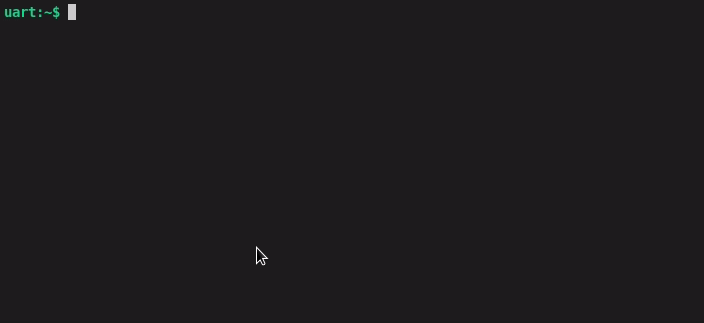
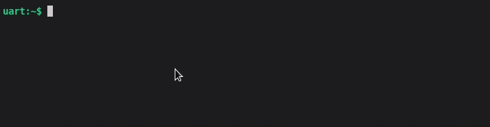

# IR Tool

Infra-red (IR) transmitter and receiver.
A simple Zephyr project for TV control and general IR experiments.

Features:

- Based on the https://docs.zephyrproject.org/latest[Zephyr project] - interactive UART shell interface
- Support for ESP32-DevKitC and SAMD21 Mini, easily portable to other boards
- IR receiving using interrupts
- NEC protocol decoding and encoding (using https://github.com/privara/nec-protocol[nec_protocol] library)
- Repeating the last received IR message (protocol independent)
- Configurable receive timeout
- Adjustable timing compensation for both transmitting and receiving

## Usage

### HW

A suitable IR LED and a 38-kHz IR receiver is needed for transmitting and receiving, respectively. The LED can be switched directly or using an N-type MOSFET, to increase the output power.

For instance, the following components can be used:

- LED: link:datasheets/hsdl4200.pdf[HSDL-4200]
- N-MOSFET: link:datasheets/bs170.pdf[BS170]
- Receiver: link:datasheets/osrb38c9aa.pdf[OSRB38C9AA]

It is possible to hook-up only the LED or the receiver, if the other functionality is not required (IR receiving can be disabled in the shell, or you can tie the recv pin to GND).

[cols="1,1,1"]
|===
|Devboard |IR LED pin | IR receiver pin

|ESP32-DevKitC
|25
|14

|SAMD21 Mini
|D13 (PA17)
|D11 (PA16)
|=== 

### Shell

In a terminal, connect to the USB UART port - the interactive shell interface will show.

There is a help message for each available command, simply start with the `help` command.

#### Receiving
Receiving is enabled by default, but you can also use `ir_recv disable` and `ir_recv enable`.

Each received messsage is decoded using the https://github.com/privara/nec-protocol[nec_protocol] library and results are shown.

#### Transmitting NEC command

You can either transmit a NEC message (8-bit address and command) using `ir_send nec <address> <command>` or you can transmit the last received message - `ir_send last_recv`.

#### Timing adjustments
The application internally represents each IR message as a sequence of pulse and space durations (waveform). The IR receivers usually make the pulses shorted and spaces longer, so the received waveform may not be sucessfully decoded. To compensate for this, there are configurable adjustments for both receiving and transmitting.

The default adjustment will prolong all received pulses by 50 microseconds and shorten all spaces by 50 microseconds. This could also be set by the following command:

[source]
----
ir_adj recv 50 -50
----

## Building and flashing

Clone the repository, including the sub-modules:

[source]
----
git clone https://github.com/privara/nec-protocol --recursive
----

Build for the target board and flash using Zephyr's https://docs.zephyrproject.org/latest/develop/west/index.html[west]:
[source]
----
west build --pristine -b <esp32/adafruit_feather_m0_basic_proto> ir-tool/app
west flash
----

### Build options
Refer to the link:app/Kconfig[KConfig] file.

## Porting to other boards
Refer to DT-overlays for currently supported boards.

PWM at 38 kHz is required for transmitting.
